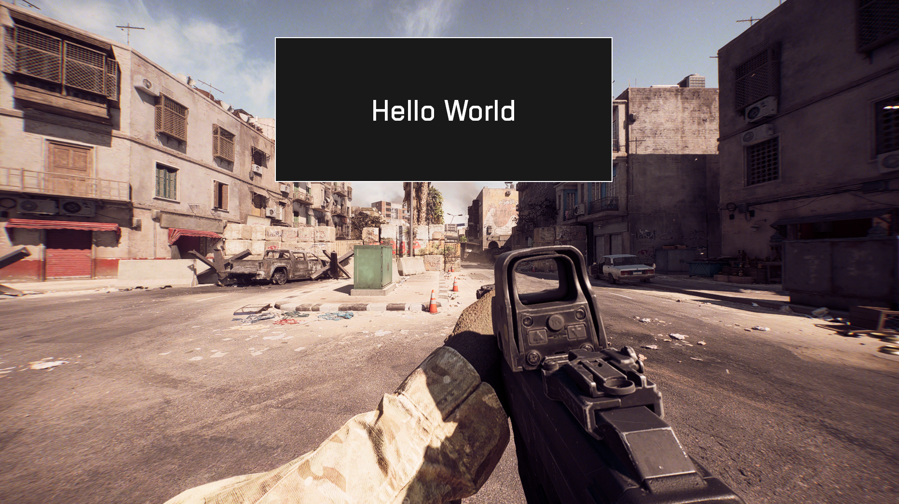

# UI Tutorials

This is a bunch of tutorials on how to use the UI featues in bf6

Currently we have the following tutorials
### Basic. Displays a "Hello, World" on screen.

### Counter. Updates a counter every second.

